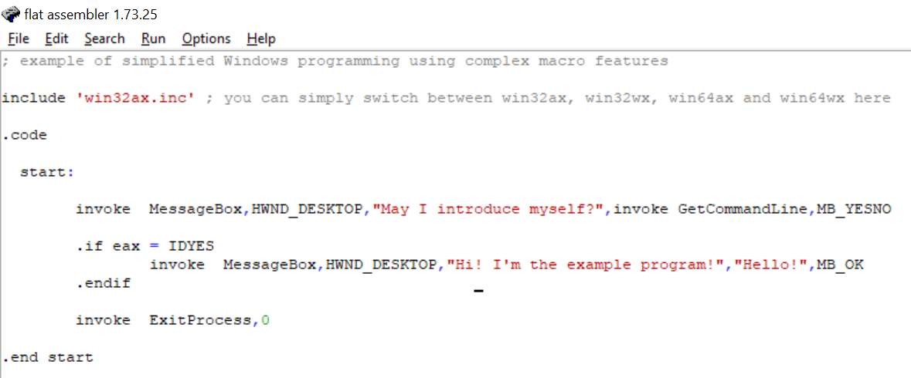
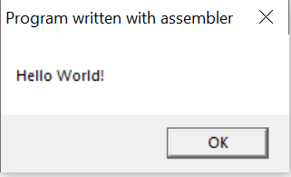
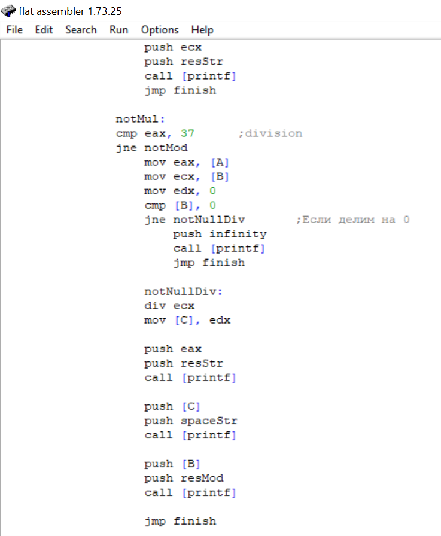

# H_ASSIGNMENT_ABC
Шкляр Михаил, ДЗ №1 по Архитектуре вычислительных систем
## 1 Программа
Я начал изучение с программы, которая называлась Hello, так как решил, что это булет самый начальный вариант:
вывод строки Hello, World на экран. Оказалось не так, но я решил таки изучить эту программу.
Изначально программа была такой:

Появлялось окошко с вопросом, может ли оно представиться и, если говоришь да, выводится сообщение: "Я - прогрпмма-пример" и заголовок hello.
Я разобрался со всеми элементами программы и переделал её, она стала выглядеть так:

Я добавил else со своей фразой и также добавил 1 if, который проверяет, имеет ли значение eax сейчас "ОК" и, если да, а по ходу программы это всегда так,
выводит еще одно окошко с сообщением. Кроме того, я заменил в 1 месте MB_OK на 1, которая добавляет еще возможность выбрать опцию отмена.
Добавленное мной окошко с сообщением:

## 2 Программа
Данная программа создает блокнот, в который можно писать и обновлять страницу. Отсутствует функция сохранения.
Изначально программа выглядела таким образом:

Результат запуска программы:

Код программы очень большой, но можно было выделить определенные детали, в том числе множество подключенных библиотек.
Я изменил некоторые цифры, которые, как я понял, отвечали за размер окна. Кроме того я изменил некоторые сообщения.
Ожно из них я привожу на скриншоте с результатом работы измененной программы:

## 3 Программа
Дальше я решил посмотреть обучающие видеоролик и.
Я узнал, что обычная программа строится таким образом:

После этого я, пользуясь данными из ролика смог написать программу, выводящую строку:

Она в принципе помогла мне разобраться с распределением кода по секциям, подключением библиотек, вызовом функций.
Я узнал, что когда мы присваиваем значение константам, они автоматически заменяются при компиляции, а вот метки просто являются указателями на данные.
В моей программе я использовал 3 функции: ExitProcess, ptintf и getch. NULL нужен был для функции ExitProcess. C помощью push я закидывал данные в стек,
а с помощью call вызывал функции.
Вот результат выполнения программы:

## 4 Программа
Теперь я решил разобраться с аналогичной программой, но уже в папке examples с примерами, скаченными при установке.
В данной программе:

я изменил метки с данными для messagebox. 
Исходный вывод:

В принципе, после понимания программы 3, эта программа отлично наслоилась, большая часть программы была понятной.
Результат измененной программы:

## 5 Программа
Последней программой будет так называемый калькулятор, который я напишу самостоятельно используя видеоматериалы.
Программа получилась очень объемной, поэтому много скриншотов.
С помощью нее я узнал, что необходимо знать кодировку ASCII для решения некоторых задач, а также изучил циклы.
Чтобы не скидывать несколько раз, сразу скину конечный вариант:

Первоначальный результат работы программы выглядел так:

Я изменил метки на более понятные и сделал вывод до 5 знаков после запятой в случае деления:

Кроме того я рассмотрел исключительную ситуацию с неверным вводом и добавил соответствующее сообщение:

